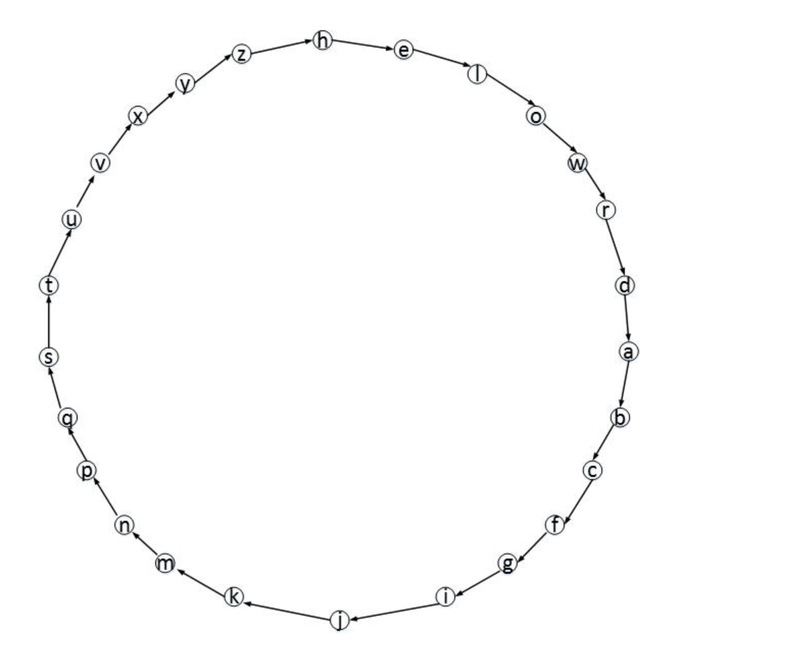

# 文件加密（环）

**【问题描述】（建议用链表实现）**

有一种文本文件加密方法，其方法如下：

1、密钥由所有ASCII码可见字符（ASCII码编码值32-126为可见字符）组成，密钥长度不超过32个字符；

2、先将密钥中的重复字符去掉，即：只保留最先出现的字符，其后出现的相同字符都去掉；

3、将不含重复字符的密钥和其它不在密钥中的可见字符（按字符升序）连成一个由可见字符组成的环，密钥在前，密钥的头字符为环的起始位置；

4、设原密钥的第一个字符（即环的起始位置）作为环的开始位置标识，先从环中删除第一个字符（位置标识则移至下一个字符），再沿着环从下一个字符开始顺时针以第一个字符的ASCII码值移动该位置标识至某个字符，则该字符成为第一个字符的密文字符；然后从环中删除该字符，再从下一个字符开始顺时针以该字符的ASCII码值移动位置标识至某个字符，找到该字符的密文字符；依次按照同样方法找到其它字符的密文字符。当环中只剩一个字符时，则该剩下的最后一个字符的密文为原密钥的第一个字符。

下面以可见字符集只由小写字母组成（**注意：实际题目要求是ASCII 32-126，此处仅为示例**）为例说明对应文字字符集生成过程。如果密钥为：`helloworld`，将密钥中重复字符去掉后为：`helowrd`，将不在密钥中的小写字母按照升序添加在密钥后，即形成字符串：`helowrdabcfgijkmnpqstuvxyz`，该字符串形成的环如下图所示：



明码的第一个字母为h，h也是环的起始位置。h的ASCII码制为104，先把h从环中删除，再从下一个字母e开始顺时针沿着环按其ASCII值移动位置标识104次（即：字母e为移动第1次，共移动位置标识104次）至字母w，则h的密文字符为w。w的ASCII码制为119，然后将w从环中删除，再从下一个字母r开始顺时针沿着环移动位置标识119次至字母l，则w的密文字符为l。依次按照同样方法找到其它字母的密文字符。环中剩下的最后一个字母为x，则x的密文字符为明码的第一个字母h。按照这种方法形成的密文转换字符表为：

| a | b | c | d | e | f | g | h | i | j | k | l | m | n | o | p | q | r | s | t | u | v | w | x | y | z |
| --- | --- | --- | --- | --- | --- | --- | --- | --- | --- | --- | --- | --- | --- | --- | --- | --- | --- | --- | --- | --- | --- | --- | --- | --- | --- |
| q | g | k | c | d | r | o | w | x | u | t | s | f | i | m | b | z | a | y | v | n | j | l | h | p | e |

上方为原文字符，下方为对应的密文字符。由**所有ASCII可见字符**组成的字符集密文字符生成方式与上例相同。

编写程序实现上述文件加密方法。**密钥从标准输入读取**，待加密文件为当前目录下的`in.txt`文件，该文件中的字符若是可见字符，则按照上述方法进行加密，否则原样输出（例如：回车换行符），加密后生成的密文文件为当前目录下的`in_crpyt.txt`。

**【输入形式】**

密钥是从标准输入读取的一行字符串，可以包含任意ASCII码可见字符（ASCII码编码值32-126为可见字符），**长度不超过32个字符**。

**【输出形式】**

加密后生成的密文文件为当前目录下的`in_crpyt.txt`。

**【样例输入】**

```text
C Programming(Second Edition)

```

假设`in.txt`文件内容为：

```text
This book is meant to help the reader learn how to program in C. It is the definitive reference guide, now in a second editi
on. Although the first edition was written in 1978, it continues to be a worldwide best-seller. This second edition brings th
e classic original up to date to include the ANSI standard.

From the Preface:

```

**【样例输出】**

`in_crpyt.txt`文件内容为：

```text
KgklW#33>WklWA\^M8W83Wg\Z,W8g\WP\^u\PWZ\^PMWg3jW83W,P30P^AWkMWX5W.8WklW8g\Wu\EkMk8kt\WP\E
\P\MR\W0-ku\+WM3jWkMW^Wl\R3MuW\uk8k3M5WIZ8g3-0gW8g\WEkPl8W\uk8k3MWj^IWjPk88\MWkMW'71G+Wk8
WR3M8kM-\lW83W#\W^Wj3PZujku\W#\l8Jl\ZZ\P5WKgklWl\R3MuW\uk8k3MW#PkM0lW8g\WRZ^llkRW3Pk0kM^ZW-,
W83Wu^8\W83WkMRZ-u\W8g\WIOY.Wl8^Mu^Pu5

4P3AW8g\WdP\E^R\(

```

**【样例说明】**

输入的密钥为`C Programming(Second Edition)`，由该密钥生成的字符串环中字符依次为：

`C Progamin(SecdEt)!"#$%&'*+,-./0123456789:;<=>?@ABDFGHIJKLMNOQRTUVWXYZ[\]^_`bfhjklpqsuvwxyz{|}~`

形成的字符转换字符表（第一行为原ASCII字符，第二行为对应的密文字符）为：

```text
 !"#$%&'()*+,-./0123456789:;<=>?@ABCDEFGHIJKLMNOPQRSTUVWXYZ[\]^_`abcdefghijklmnopqrstuvwxyz{|}~
Wzx]veT{HL%*+J5Cs'~}q/olG7(9;<FpSI&X2n4 6.h:U[OVdBwYK`f?Q_a|rc@"i^#Ru\E0gk=>ZAM3,yPl8-tj!m)$bDN

```

按照该密文转换字符表将`in.txt`中的内容转换成加密字符输出到`in_crpyt.txt`中。

**【评分标准】**

该题要求对指定的文件进行加密，提交的文件名为：`encode.c`。