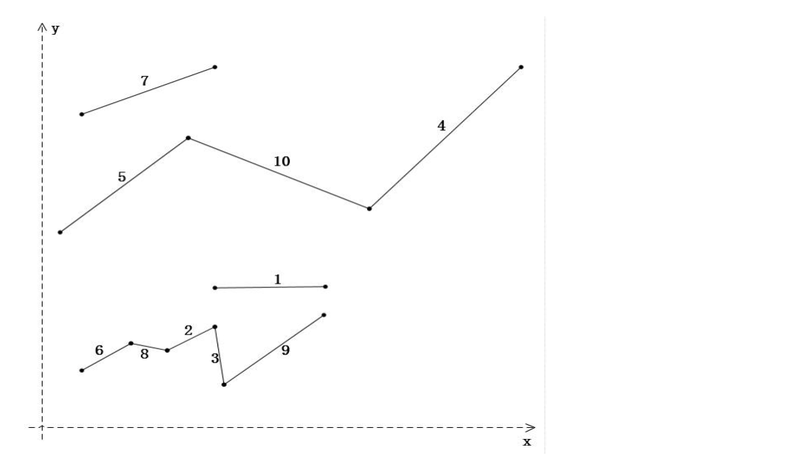

# 连续线段

**【问题描述】**
平面上两个点（一个点由(x,y)坐标组成）可构成一个线段，两个线段如果有一个端点相同，则可构成一个连续线段。假设构成线段的两个端点为v1(x1,y1)和v2(x2,y2)，在此满足x1<x2，其中v1称为线段的起点，v2为线段的终点。同样，对于连续线段来说，在此满足  （，n为连续线段中的端点数，为相应端点的X轴坐标）。输入一组线段（用两个端点的x、y坐标表示线段，**线段个数大于等于2，小于等于100**），编程计算出连续线段中包含最多线段数的线段，输出相应的线段数和起点位置（注意，**不是最长的连续线段，是包含最多线段的连续线段**）。例如：



上图中有10个线段，其中5、10、4号线段连成了一条连续线段，线段数3条，起点位置为5号线段的左端点；6、8、2、3、9号线段连成了另一条连续线段，该连续线段包含的线段数最多，为5条，起点位置是6号线段的左端点。

**注意：**

1. 不考虑线段中间相交的情况；
2. 不会有三条或三条以上的线段共一个端点；
3. 只会出现一条包含最多线段的连续线段；

**【输入形式】**
先从控制台输入线段数，然后从下一行开始分行输入各线段两个端点的x、y坐标，其中**第一个端点的X轴坐标小于第二个端点的X轴坐标**，即x1<x2，x、y坐标都用整数表示，不会超过int的表示范围。各整数坐标值间以一个空格分隔。

**【输出形式】**
先在控制台输出包含最多线段数的连续线段的线段数，然后输出连续线段的起点的x、y坐标，输出数据**都以一个空格分隔**。

**【样例输入】**

```text
10
80 75 125 75
60 40 80 55
80 55 90 20
140 120 195 205
10 111 70 165
22 35 43 43
22 175 80 205
43 43 60 40
90 20 125 60
70 165 140 120

```

**【样例输出】**

```text
5 22 35

```

**【样例说明】**
输入了十个线段，第一个线段两个端点分别为(80,75) 和(125,75)，其它线段类似，如上图所示，这些线段所构成的连续线段中包含最多线段数的连续线段的线段数为5，起点为(22,35)，所以输出：5 22 35。

**【评分标准】**
通过所有测试点将得满分。提交程序名为 `line.c`。