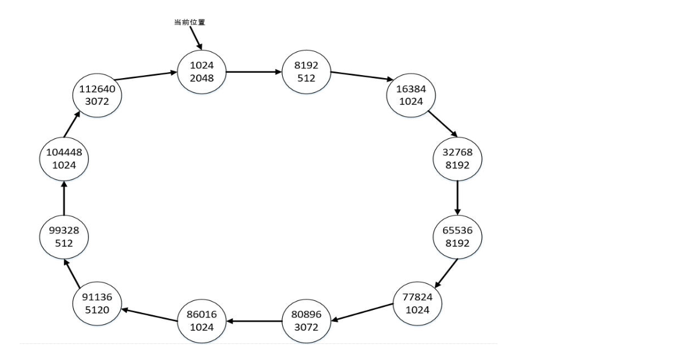
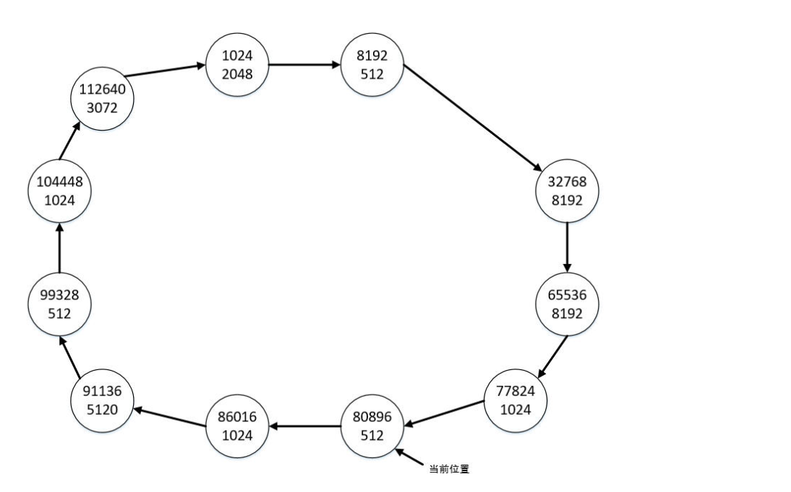
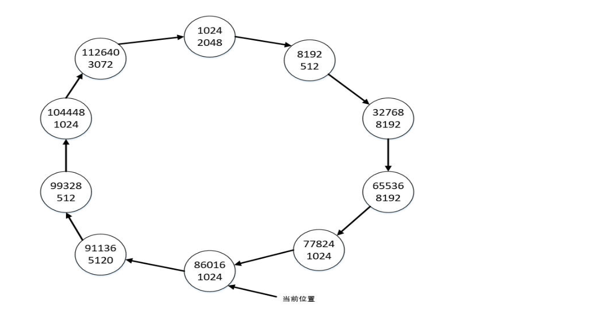

# 空闲空间申请模拟（最佳适应）

**【问题描述】**

在操作系统中，空闲存储空间通常以空闲块链表方式组织，每个块包含起始位置、块长度及一个指向下一块的指针。空闲块按照**存储位置升序组织**，最后一块指向第一块（构成**循环链表**）。当有空间申请请求时，按照如下原则在空闲块循环链表中寻找并分配空闲块：

1. 从当前位置开始遍历空闲块链表（**初始是从地址最小的第一个空闲块开始**），寻找满足条件的最小块（**即：大于等于请求空间的最小空闲块，如果有多个大小相同的最小空闲块，则选择遍历遇到的第一个空闲块**）（最佳适应原则）；
2. 如果选择的空闲块恰好与请求的大小相等，则将它从链表中移除并返回用户；这时**当前位置变为**移除的空闲块指向的**下一空闲块**；
3. 如果选择的空闲块大于所申请的空间大小，则将大小合适的空闲块返回给用户，剩下的部分留在空闲块链表中；这时**当前位置仍然为**该空闲块（**注：即被切割后剩余的空闲块**）；
4. 如果找不到足够大的空闲块，则申请失败；这时**当前位置不变**。

例如：下图示例给出了空闲块链表的初始状态，每个结点表示一个空闲块，结点上面的数字指定空闲块的起始位置，下面的数字指定空闲块的长度，**位置和长度都用正整数表示，大小不超过int表示范围**。当前位置为最小地址为1024的空闲块。



若有4个申请空间请求，申请的空间大小依次为：1024、2560、10240和512。则从当前位置开始遍历上图的链表，按照上述原则找到满足条件的最小块为地址是16384的空闲块，其长度正好为1024，所以将其从链表中删除，这时链表状态如下图所示，当前位置变成地址为32768的空闲块。


从当前位置开始为第二个空间请求（大小为2560）遍历链表，按照上述原则找到满足条件的最小块为地址是80896的空闲块，其长度为3072，大于请求的空间大小，于是申请空间后空闲块剩余的长度为512，当前位置为地址是80896的空闲块，链表状态如下图所示：


从当前位置开始为第三个空间请求（大小为10240）遍历链表，遍历一圈后发现找不到足够大的空闲块，则忽略该请求，当前位置不变。下面继续为第四个空间请求（大小为512）遍历链表，按照上述原则找到满足条件的最小块为当前位置的空闲块，其长度等于请求的空间大小，于是将该空闲块删除后，链表状态变为下图所示：



编写程序，模拟上述空闲空间申请。

**【输入形式】**

先从控制台读入一正整数，表示当前空闲块的个数（大于0且小于等于100）。

然后**按照起始位置由小到大**的顺序分行输入每个空闲块的起始位置和长度，**位置和长度都用正整数表示，大小不超过int表示范围，两数值间以一个空格分隔**。

最后在新的行上依次输入申请空间的大小，以-1表示结束，各数值间以一个空格分隔，申请请求的个数不超过100个。

**【输出形式】**

按照上述原则模拟空闲空间申请后，输出当前空闲空间链表状态，即**从当前位置开始**，遍历链表，**分行输出**剩余空闲块的起始位置和长度，位置和长度间以一个空格分隔。若申请完后，链表中没有空闲块，则什么都不输出。

**【样例输入】**

```text
12
1024 2048
8192 512
16384 1024
32768 8192
65536 8192
77824 1024
80896 3072
86016 1024
91136 5120
99328 512
104448 1024
112640 3072
1024 2560 10240 512 1024 6400 512 -1

```

**【样例输出】**

```text
104448 1024
112640 3072
1024 2048
8192 512
32768 1792
65536 8192
77824 1024
91136 5120

```

**【样例说明】**

样例输入了12个空闲块的信息，形成了如上述第一个图所示的空闲块链表；然后读取了7个空间申请请求，为前4个申请请求分配空间后，空闲块链表状态为上述最后一张图所示。满足第五个请求后，将删除地址为86016的空闲块；满足第六个请求后，地址为32768的空闲块剩余长度为1792；满足第七个请求后，将删除地址为99328的空闲块，这时链表中剩余8个空闲块，当前位置为地址是104448的空闲块，从该空闲块开始依次遍历输出所有剩余空闲块的起始位置和长度。

**【评分标准】**

该题要求编程模拟实现空闲空间的申请，提交程序名为 `memory.c`。
