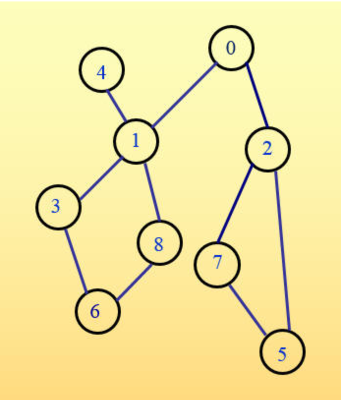

# 图遍历（图‑基本题）
## 问题描述
给定一个无向图和一个图顶点，编程输出该图删除给定顶点前后按深度优先遍历及广度优先遍历方式遍历的图顶点序列。

给定的无向图和图顶点满足以下要求：
1. 无向图的顶点个数n大于等于3，小于等于100，输入时顶点编号用整数0～n‑1表示；
2. 无向图在删除给定顶点前后都是连通的；
3. 无论何种遍历，都是从编号为0的顶点开始遍历，访问相邻顶点时按照编号从小到大的顺序访问；
4. 删除的顶点编号不为0。

## 输入形式
先从标准输入中输入图的顶点个数和边的个数，两整数之间以一个空格分隔，然后从下一行开始分行输入每条边的信息（用边两端的顶点编号表示一条边，以一个空格分隔顶点编号，边的输入次序和每条边两端顶点编号的输入次序可以是任意的，但边不会重复输入），最后在新的一行上输入要删除的顶点编号。

## 输出形式
分行输出各遍历顶点序列，顶点编号之间以一个空格分隔。先输出删除给定顶点前的深度优先遍历顶点序列和广度优先遍历顶点序列，再输出删除给定顶点后的深度优先遍历顶点序列和广度优先遍历顶点序列。

## 样例输入
```
9 10
0 1
0 2
1 4
1 3
1 8
8 6
3 6
7 2
7 5
5 2
3
```

## 样例输出
```
0 1 3 6 8 4 2 5 7
0 1 2 3 4 8 5 7 6
0 1 4 8 6 2 5 7
0 1 2 4 8 5 7 6
```

## 样例说明
输入的无向图有9个顶点，10条边，要删除的顶点编号为3。



从顶点0开始，按照深度优先和广度优先遍历的顶点序列分别为：0 1 3 6 8 4 2 5 7和0 1 2 3 4 8 5 7 6。删除编号为3的顶点后，按照深度优先和广度优先遍历的顶点序列分别为：0 1 4 8 6 2 5 7和0 1 2 4 8 5 7 6。

## 评分标准
该题要求按照深度优先和广度优先遍历方式输出删除给定顶点前后的遍历序列，提交程序名为graphSearch.c。