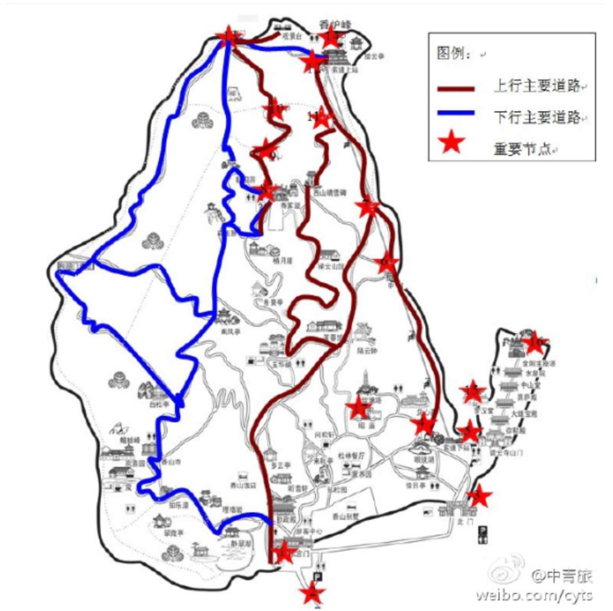
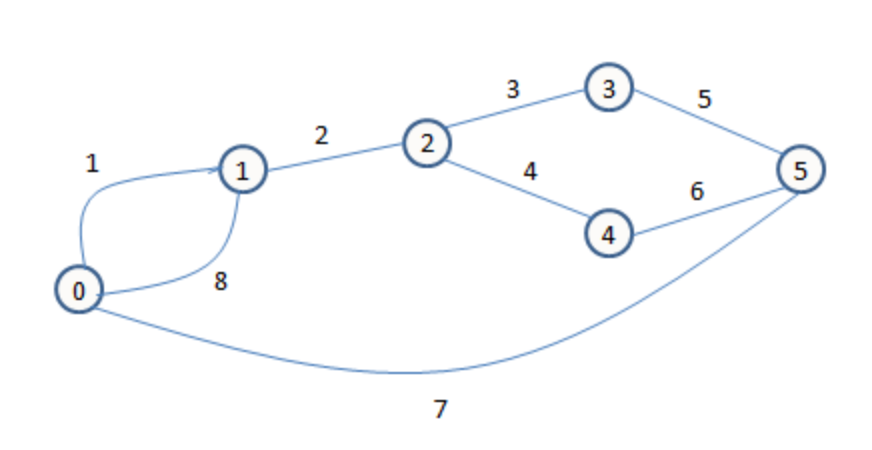

# 独立路径数计算
## 问题描述
老张和老王酷爱爬山，每周必爬一次香山。有次两人为从东门到香炉峰共有多少条路径发生争执，于是约定一段时间内谁走过对方没有走过的路线多谁胜。

给定一线路图（无向连通图，两顶点之间可能有多条边），编程计算从起始点至终点共有多少条独立路径，并输出相关路径信息。

注：独立路径指的是从起点至终点的一条路径中至少有一条边是与别的路径中所不同的，同时路径中不存在环路。



## 输入形式
图的顶点按照自然数（0,1,2,...,n）进行编号，其中顶点0表示起点，顶点n‑1表示终点。从标准输入中首先输入两个正整数n,e，分别表示线路图的顶点的数目和边的数目，然后在接下的e行中输入每条边的信息，具体形式如下：

`<n> <e>`

`<e1> <vi1> <vj1>`

`<e2> <vi2> <vj2>`

...

`<en> <vin> <vjn>`

说明：第一行`<n>`为图的顶点数,`<e>`表示图的边数；第二行`<e1> <vi1> <vj1>`分别为边的序号（边序号的范围在[0,1000）之间，即包括0不包括1000）和这条边的两个顶点，中间由一个空格分隔；其它类推；并且是按照边序号从小到大的顺序输入的。

## 输出形式
输出从起点0到终点n‑1的所有路径（用边序号的序列表示路径且路径中不能有环），每行表示一条由起点到终点的路径（由边序号组成，中间有一个空格分隔，最后一个数字后跟回车），并且所有路径按照字典序输出。

## 样例输入
```
6 8
1 0 1
2 1 2
3 2 3
4 2 4
5 3 5
6 4 5
7 0 5
8 0 1
```

## 样例输出
```
1 2 3 5
1 2 4 6
7
8 2 3 5
8 2 4 6
```

## 样例说明


输出的第一个路径1 2 3 5，表示一条路径，先走1号边(顶点0到顶点1)，然后走2号边(顶点1到顶点2)，然后走3号边(顶点2到顶点3)，然后走5号边(顶点3到顶点5)到达终点。

## 评分标准
通过所有测试点得满分。