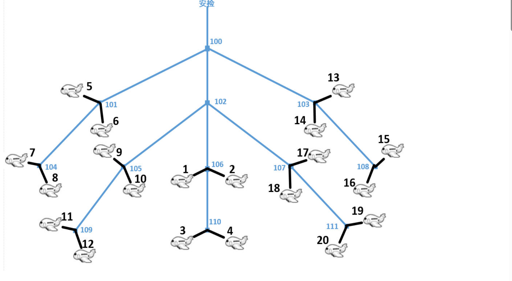

# 服务优化
## 问题描述
假设某机场所有登机口（Gate）呈树形排列（树的度为3），安检处为树的根。图中的分叉结点（编号大于等于100）表示分叉路口，登机口用小于100的编号表示（其一定是一个叶结点）。通过对机场所有出发航班的日志分析，得知每个登机口每天的平均发送旅客流量。作为提升机场服务水平的一个措施，在不改变所有航班相对关系的情况下（即：出发时间不变，原在同一登机口的航班不变），仅改变登机口（例如：将3号登机口改到5号登机口的位置），使得整体旅客到登机口的时间有所减少（即：从安检口到登机口所经过的分叉路口最少）。


编写程序模拟上述登机口的调整，登机口调整规则如下：
1）首先按照由大到小的顺序对输入的登机口流量进行排序，流量相同的按照登机口编号由小到大排序；
2）从上述登机口树的树根开始，将登机口按照从上到下（安检口在最上方）、从左到右的顺序，依次对应上面排序后将要调整的登机口。

例如上图的树中，若只考虑登机口，则从上到下有三层，第一层从左到右的顺序为：5、6、14、13，第二层从左到右的顺序为：7、8、9、10、1、2、18、17、16、15，第三层从左到右的顺序为：11、12、3、4、20、19。若按规则1排序后流量由大至小的前五个登机口为3、12、16、20、15，则将流量最大的3号登机口调整到最上层且最左边的位置（即：5号登机口的位置），12号调整到6号，16号调整到14号，20号调整到13号，15号调整到第二层最左边的位置（即7号登机口的位置）。

## 输入形式
1）首先按层次从根开始依次输入树结点之间的关系。其中分叉结点编号从数字100开始（树根结点编号为100，其它分叉结点编号没有规律但不会重复），登机口为编号小于100的数字（编号没有规律但不会重复，其一定是一个叶结点）。树中结点间关系用下面方式描述：
`R S1 S2 S3 -1`

其中R为分叉结点，从左至右S1，S2，S3分别为树叉R的子结点，其可为树叉或登机口，由于树的度为3，S1，S2，S3中至多可以2个为空，最后该行以-1和换行符结束。各项间以一个空格分隔。如：
`100 101 102 103 -1`
表明编号100的树根有三个子叉，编号分别为101、102和103，又如：
`104 7 8 -1`
表明树叉104上有2个编号分别为7和8的登机口。

假设分叉结点数不超过100个。分叉结点输入的顺序不确定，但可以确定：输入某个分叉结点信息时，其父结点的信息已经输入。

输入完所有树结点关系后，在新的一行上输入`-1`表示树结点关系输入完毕。

2）接下来输入登机口的流量信息，每个登机口流量信息分占一行，分别包括登机口编号（1~99之间的整数）和流量（大于0的整数），两整数间以一个空格分隔。登机口数目与前面构造树时的登机机口数目一致。

## 输出形式
按照上述调整规则中排序后的顺序（即按旅客流量由大到小，流量相同的按照登机口编号由小到大）依次分行输出每个登机口的调整结果：先输出调整前的登机口编号，然后输出字符串`->`（由英文减号字符与英文大于字符组成），再输出要调整到的登机口编号。

## 样例输入
```
100 101 102 103 -1
103 14 108 13 -1
101 5 104 6 -1
104 7 8 -1
102 105 106 107 -1
106 1 110 2 -1
108 16 15 -1
107 18 111 17 -1
110 3 4 -1
105 9 109 10 -1
111 20 19 -1
109 11 12 -1
-1
17 865
5 668
20 3000
13 1020
11 980
8 2202
15 1897
6 1001
14 922
7 2178
19 2189
1 1267
12 3281
2 980
18 1020
10 980
3 1876
9 1197
16 980
4 576
```

## 样例输出
```
12->5
20->6
8->14
19->13
7->7
15->8
3->9
1->10
9->1
13->2
18->18
6->17
2->16
10->15
11->11
16->12
14->3
17->4
5->20
4->19
```

## 样例说明
样例输入了12条树结点关系，形成了如上图的树。然后输入了20个登机口的流量，将这20个登机口按照上述调整规则1排序后形成的顺序为：`12、20、8、19、7、15、3、1、9、13、18、6、2、10、11、16、14、17、5、4`。最后按该顺序将所有登机口按照上述调整规则2进行调整，输出调整结果。

## 评分标准
该题要求计算并输出登机口的调整方法，提交程序名为：`adjust.c`