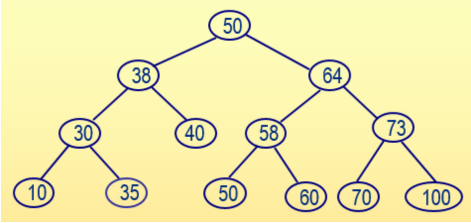

# 树叶节点遍历（树‑基础题）
## 问题描述
从标准输入中输入一组整数，在输入过程中按照**左子结点值小于根结点值、右子结点值大于等于根结点值**的方式构造一棵二叉查找树，然后**从左至右输出所有树中叶结点的值及高度**（根结点的高度为1）。例如，若按照以下顺序输入一组整数：`50、38、30、64、58、40、10、73、70、50、60、100、35`，生成对应的二叉查找树。



从左到右的叶子结点包括：`10、35、40、50、60、70、100`，叶结点40的高度为3，其它叶结点的高度都为4。

## 输入形式
先从标准输入读取整数的个数，然后从下一行开始输入各个整数，整数之间以一个空格分隔。

## 输出形式
按照从左到右的顺序分行输出叶结点的值及高度，值和高度之间以一个空格分隔。

## 样例输入
```
13
50 38 30 64 58 40 10 73 70 50 60 100 35
```

## 样例输出
```
10 4
35 4
40 3
50 4
60 4
70 4
100 4
```

## 样例说明
按照从左到右的顺序输出叶结点（即没有子树的结点）的值和高度，每行输出一个。

## 评分标准
该题要求输出所有叶结点的值和高度，提交程序名为：`bst.c`
